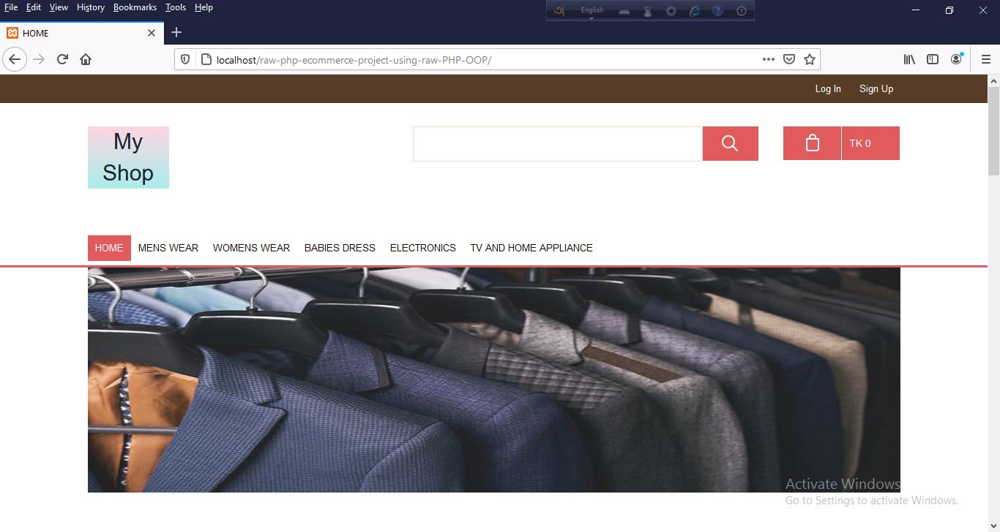
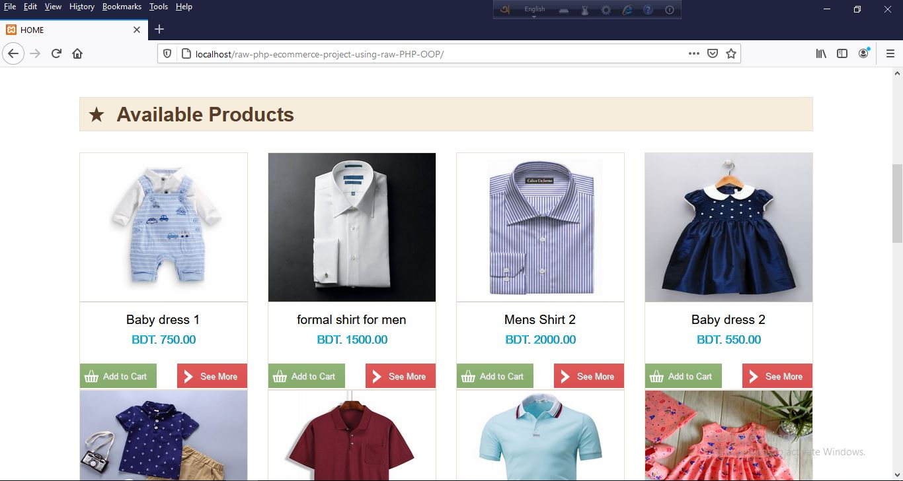
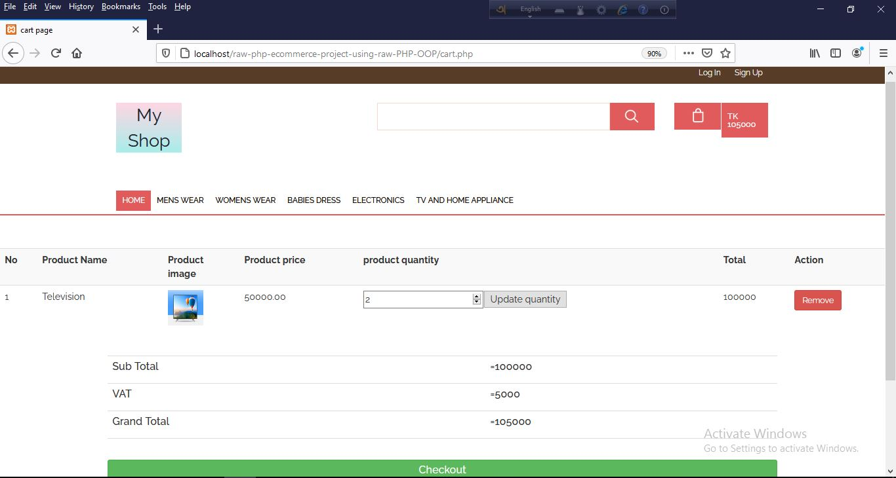

This is an ecommerce application built with RAW PHP. It has two part. Customer end part and admin end part. Customer end part shows products and customers can buy these products. To submit an order customer has to register-login in the application.

Admin end part is for admins to manage the application. After login the admin panel admin can add category, edit category, delete category, publish-unpublish category, add new product, edit product, delete product, publish-unpublish product etc.

Screenshots of different features and pages of this application given below.
<h3>Home page</h3>

<h3>Homepage scroll down part</h3>

<h3>Specific category page</h3>

<h3>product details page</h3>

<h3>product details page scroll down part</h3>

<h3>cart</h3>

<h3>login page</h3>

<h3>signup page</h3>

<h3>shipping page</h3>

<h3>payment page</h3>

<h3>complete order page</h3>

<h3>Admin login</h3>

<h3>admin deshboard</h3>

<h3>Admin add category</h3>

<h3>Admin manage category</h3>

<h3>admin edit category</h3>

<h3>admin add product</h3>

<h3>admin manage product</h3>

<h3>admin edit product</h3>

<h3>admin manage order page</h3>

